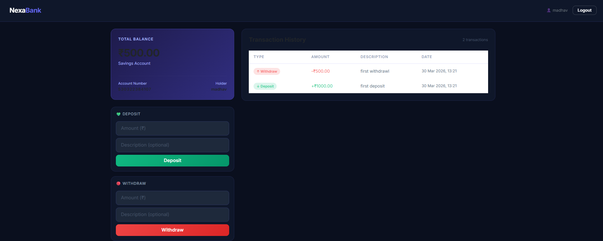

# 🏦 NexaBank — Django Banking Application

A full-stack banking web application built with Django, featuring multi-user support, real-time transactions, and a clean dark UI.




## ✨ Features

- **Multi-User Support** — Multiple users can register and manage their own accounts independently
- **Secure Authentication** — Django session-based login/logout with CSRF protection
- **Account Management** — Savings and Current account types with unique 12-digit account numbers
- **Deposit & Withdrawal** — Instant balance updates with transaction logging
- **Fund Transfer** — Transfer funds between accounts using account number or username search
- **User Search** — Find any registered user by username before initiating a transfer
- **Transaction History** — Complete log of all deposits, withdrawals, and transfers with timestamps
- **Responsive UI** — Clean dark-themed interface built with Bootstrap 5


## 🛠️ Tech Stack

| Layer | Technology |
|-------|-----------|
| Backend | Python, Django 6.x |
| Frontend | HTML5, CSS3, Bootstrap 5 |
| Database | SQLite3 |
| Auth | Django Session Authentication |
| Version Control | Git, GitHub |


## 📁 Project Structure
```
nexabank/
├── nexabank/           # Project settings & main URLs
│   ├── settings.py
│   └── urls.py
├── accounts/           # Main app
│   ├── models.py       # BankAccount, Transaction models
│   ├── views.py        # All business logic
│   ├── urls.py         # App URL routing
│   └── templates/
│       └── accounts/
│           ├── base.html
│           ├── landing.html
│           ├── login.html
│           ├── register.html
│           └── dashboard.html
├── manage.py
└── requirements.txt
```


## ⚙️ Local Setup
```bash
# 1. Clone the repository
git clone https://github.com/Madhav-Sharma-2003/nexabank.git
cd nexabank

# 2. Create virtual environment
python -m venv venv
venv\Scripts\activate        # Windows
source venv/bin/activate     # Linux/Mac

# 3. Install dependencies
pip install -r requirements.txt

# 4. Run migrations
python manage.py migrate

# 5. Start server
python manage.py runserver
```

Visit `http://127.0.0.1:8000/` in your browser.


## 📸 Screenshots

### Landing Page
> Register karo ya existing account se login karo

### Dashboard

> Balance card, deposit/withdrawal/transfer forms, transaction history


## 🗃️ Database Models

### BankAccount
| Field | Type | Description |
|-------|------|-------------|
| user | OneToOneField | Linked Django user |
| account_number | CharField | Unique 12-digit number |
| account_type | CharField | Savings / Current |
| balance | DecimalField | Current balance |
| created_at | DateTimeField | Account creation time |

### Transaction
| Field | Type | Description |
|-------|------|-------------|
| account | ForeignKey | Linked bank account |
| transaction_type | CharField | deposit / withdrawal / transfer |
| amount | DecimalField | Transaction amount |
| description | CharField | Optional note |
| timestamp | DateTimeField | Transaction time |


## 🔐 Security Features

- CSRF protection on all POST forms
- Password hashing via Django's built-in auth system
- Login required decorator on protected views
- Duplicate account number prevention
- Insufficient balance validation


## 🚀 Future Improvements

- [ ] Deploy on Railway / Render
- [ ] REST API with Django REST Framework + JWT
- [ ] Transaction PDF export
- [ ] Fixed Deposit (FD) feature
- [ ] Email notifications on transactions
- [ ] Admin dashboard with analytics
